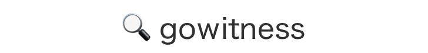

<h1 align="center">
  <br>
  <a href="https://github.com/sensepost/gowitness">
    </a>
  <br>
  <br>
</h1>

<h4 align="center">A golang, web screenshot utility using Chrome Headless.</h4>
<p align="center">
  <a href="https://twitter.com/leonjza"></a>
  <a href="https://goreportcard.com/report/github.com/sensepost/gowitness"></a>
  <a href="https://hub.docker.com/r/leonjza/gowitness"></a>
</p>
<br>

## introduction

`gowitness` is a website screenshot utility written in Golang, that uses Chrome Headless to generate screenshots of web interfaces using the command line. Both Linux and macOS is supported, with Windows support 'partially working'.

Inspiration for `gowitness` comes from [Eyewitness](https://github.com/ChrisTruncer/EyeWitness). If you are looking for something with lots of extra features, be sure to check it out along with these [other](https://github.com/afxdub/http-screenshot-html) [projects](https://github.com/breenmachine/httpscreenshot).

## installation

All you would need is an installation of the latest Google Chrome or Chromium and `gowitness` itself. `gowitness` can be downloaded using `go get -u github.com/sensepost/gowitness` or using the
binaries available for download from the [releases](https://github.com/sensepost/gowitness/releases) page.

## running using docker

To screenshot a page using docker, simply run the following command that would also pull the latest gowitness image:

```bash
docker run --rm -it -v $(pwd)/screenshots:/screenshots leonjza/gowitness:latest single --url=https://www.google.com
```

Keep in mind that a folder needs to be mounted into the container for `gowitness` to write your screenshots to, otherwise they will be lost when the container exits. The container is configured with the `/screenshots/` directory as the working directory, so the above command mounts a local `screenshots/` directory there.

If you want to read an nmap file, save it locally into a screenshots directory, and use it with:

```bash
docker run --rm -it -v $(pwd)/screenshots:/screenshots leonjza/gowitness:latest nmap -f /screenshots/nmap.xml
```

For any other commands, you can get help similar to the local binary install. For example:

```bash
docker run --rm -it -v $(pwd)/screenshots:/screenshots leonjza/gowitness:latest -h
A commandline web screenshot and information gathering tool by @leonjza

Usage:
  gowitness [command]

Available Commands:
  file        Screenshot URLs sourced from a file
  help        Help about any command
  nmap        Screenshot services from an Nmap XML file
  report      Work with gowitness reports
  scan        Scan a CIDR range and take screenshots along the way
  single      Take a screenshot of a single URL
  version     Prints the version of gowitness
```

## build from source

To build `gowitness` from source, follow the following steps:

* Ensure that you have at least golang version 1.13.
* Clone this repository and `cd` into it.
* Run `go build` to get the `gowitness` binary for the current machine.
* Or, `make` to build for all targets. Binaries will be in the `build/` diretory.

## usage examples

### screenshot a single website

`$ gowitness single --url=https://www.google.com/`

This should result in a file being created called: `https-www.google.com.png`

### screenshot a cidr

`$ gowitness scan --cidr 192.168.0.0/24 --threads 20`

This should result in many `.png` images in the current directory when complete. This can would also use `20` threads and not the default of `4`.

### generate a report

`$ gowitness report generate`

This should result in an `report.html` file with a screenshot report.

`$ gowitness report generate --sort-perception`

This should result in an `report.html` file with a screenshot report where screenshots are sorted using perception hashing.

`$ gowitness report list`

This should list the entries in the `gowitness.db` file.

## license

`gowitness` is licensed under a [GNU General Public v3 License](https://www.gnu.org/licenses/gpl-3.0.en.html). Permissions beyond the scope of this license may be available at http://sensepost.com/contact/.
