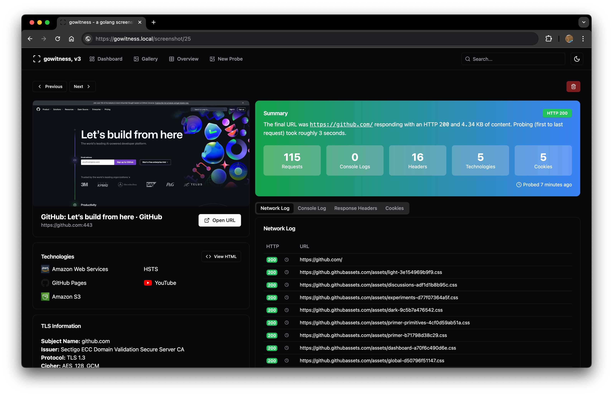

<h1 align="center">
  <br>
    gowitness
  <br>
  <br>
</h1>

<h4 align="center">A golang, web screenshot utility using Chrome Headless.</h4>
<p align="center">
  <a href="https://twitter.com/leonjza"></a>
  <a href="https://goreportcard.com/report/github.com/sensepost/gowitness"></a>
  <a href="https://github.com/sensepost/gowitness/actions/workflows/docker.yml"></a>
</p>
<br>

## introduction

`gowitness` is a website screenshot utility written in Golang, that uses Chrome Headless to generate screenshots of web interfaces using the command line, with a handy report viewer to process results. Both Linux and macOS is supported, with Windows support mostly working.

## features

The main goal of `gowitness` is to take website screenshots (**and do that well!**), while optionally saving any information it gathered along the way. That said, a short list of features include:

- Take website screenshots, obviously..., but fast and accurate!
- Ability to grab and save data (i.e., a request log, console logs, headers, cookies, etc.)
- Write data to many formats (sqlite database, jsonlines, csv, etc.)
- An epic web-based results viewer (if you saved data to SQLite) including a fully featured API!
- And many, many more!

## quick start

Grab a platform specific release binary, or compile from source. Then, scan your first target writing the results to a SQLite database and the screenshot to `./screenshots` with:

```text
gowitness scan single --url "https://sensepost.com" --write-db
```

There are many, *many* flags and scan types in `gowitness`. Just add `-h` anywhere and read all about it!

## documentation

For advanced installation information and other documentation, please refer to the wiki [here](https://github.com/sensepost/gowitness/wiki).

## screenshots





## credits

`gowitness` would not have been possible without some of these amazing projects: [chromedp](https://github.com/chromedp/chromedp), [tabler](https://github.com/tabler/tabler), [zerolog](https://github.com/rs/zerolog), [cobra](https://github.com/spf13/cobra), [gorm](https://github.com/go-gorm/gorm), [go-nmap](https://github.com/lair-framework/go-nmap), [wappalyzergo](https://github.com/projectdiscovery/wappalyzergo), [goimagehash](https://github.com/corona10/goimagehash)

## license

`gowitness` is licensed under a [GNU General Public v3 License](https://www.gnu.org/licenses/gpl-3.0.en.html). Permissions beyond the scope of this license may be available at <http://sensepost.com/contact/>.
